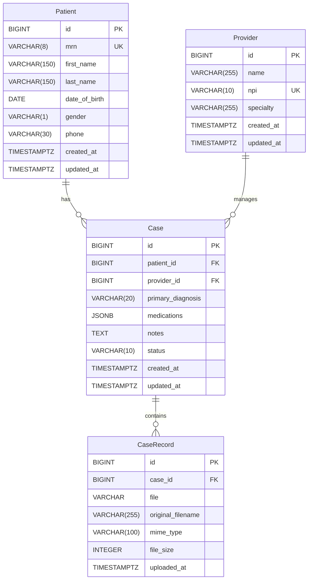

# CarePlan Platform Database PRD (Phase 1-3)

## 1. 文档目标
- 明确 Phase 1-3 的数据库设计基线。
- 统一实体、约束、索引、迁移规范。
- 作为开发、测试、上线评审的数据库参考文档。

## 2. 当前状态（已核实）
- 数据库类型：PostgreSQL
- Docker 数据库镜像：`postgres:16`
- 数据库名：`careplan_db`
- 当前实体表：`Patient`、`Provider`、`Case`、`CaseRecord`

## 3. 范围与非范围
### 范围（Phase 1-3）
- Patient 主数据
- Provider 主数据
- Case 主数据
- CaseRecord 文件元数据
- 基础数据校验与跨字段规则

### 非范围（后续阶段）
- 审计日志、去重日志、LLM 版本追踪表
- 多租户隔离、分库分表

## 4. 需求映射（Stories）
- S3: Patient CRUD + MRN 唯一
- S4: Provider upsert-by-NPI + NPI 唯一
- S5: Case 创建并关联 Patient/Provider
- S7: ICD-10 校验服务
- S8: 病历文件上传与安全校验
- S9: 跨字段规则引擎

## 5. 数据模型

### 5.1 Patient
- 表名：`Patient`
- 主键：`id` (bigint)
- 字段：
- `mrn` varchar(8), unique, 必填（8位数字）
- `first_name` varchar(150), 必填
- `last_name` varchar(150), 必填
- `date_of_birth` date, 必填
- `gender` varchar(1), 必填（M/F/O）
- `phone` varchar(30), 可空字符串
- `created_at` timestamptz
- `updated_at` timestamptz
- 索引：
- `patient_mrn_idx(mrn)`

### 5.2 Provider
- 表名：`Provider`
- 主键：`id` (bigint)
- 字段：
- `name` varchar(255), 必填
- `npi` varchar(10), unique, 必填（10位数字）
- `specialty` varchar(255), 可空字符串
- `created_at` timestamptz
- `updated_at` timestamptz
- 索引：
- `provider_npi_idx(npi)`

### 5.3 Case
- 表名：`Case`
- 主键：`id` (bigint)
- 字段：
- `patient_id` bigint FK -> `Patient(id)`, on delete cascade
- `provider_id` bigint FK -> `Provider(id)`, nullable, on delete set null
- `primary_diagnosis` varchar(20), 必填（ICD-10）
- `medications` jsonb, 默认 `[]`
- `notes` text, 默认空
- `status` varchar(10), 默认 `draft`（draft/active/closed）
- `created_at` timestamptz
- `updated_at` timestamptz

### 5.4 CaseRecord
- 表名：`CaseRecord`
- 主键：`id` (bigint)
- 字段：
- `case_id` bigint FK -> `Case(id)`, on delete cascade
- `file` varchar（文件路径）
- `original_filename` varchar(255)
- `mime_type` varchar(100)
- `file_size` integer (bytes)
- `uploaded_at` timestamptz

## 6. 约束策略
### 数据库层约束
- `Patient.mrn` 唯一
- `Provider.npi` 唯一
- 外键约束：`Case -> Patient/Provider`，`CaseRecord -> Case`

### 应用层约束
- MRN/NPI 正则校验
- ICD-10 格式 + 字典校验
- Case 跨字段规则（诊断、用药等）

## 7. 索引与性能
### 当前索引
- `patient_mrn_idx`
- `provider_npi_idx`

### 后续建议（Phase 4+）
- `Case(patient_id, created_at DESC)`
- `Case(status, created_at DESC)`
- `CaseRecord(case_id, uploaded_at DESC)`

## 8. 迁移与目录规范
- 迁移文件目录：`backend/apps/<app>/migrations/`
- 文档目录：`docs/`
- 推荐流程：
1. 修改 `models.py`
2. 执行 `python manage.py makemigrations`
3. 执行 `python manage.py migrate`
4. 在 PR 里记录迁移影响与回滚说明

## 9. 环境连接信息
- `DB_NAME=careplan_db`
- `DB_USER=postgres`
- `DB_PASSWORD=password`
- `DB_HOST=localhost`
- `DB_PORT=5433`
- Docker 映射：主机 `5433` -> 容器 `5432`

## 10. 数据存储位置
- PostgreSQL 数据存储在 Docker Volume：`careplan-platform_postgres_data`
- Docker 引擎挂载点：`/var/lib/docker/volumes/careplan-platform_postgres_data/_data`
- 容器内数据目录：`/var/lib/postgresql/data`
- 上传文件（`CaseRecord.file`）存放在 Django `MEDIA_ROOT`（当前为 `backend/media/`）

## 11. 验收标准（Phase 1-3）
- Patient/Provider/Case 可创建与查询
- MRN/NPI 唯一约束生效
- ICD-10 非法值被拦截并返回明确错误
- 跨字段规则生效
- `POST /api/cases/{id}/records` 仅接受合法文件并保存元数据

## 12. ERD（Phase 1-3）

说明：
- `Patient` 与 `Case` 是 1:N
- `Provider` 与 `Case` 是 1:N（`provider_id` 可空）
- `Case` 与 `CaseRecord` 是 1:N
- 关键唯一约束：`Patient.mrn`、`Provider.npi`
